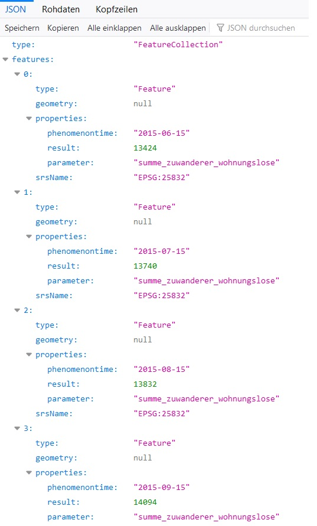
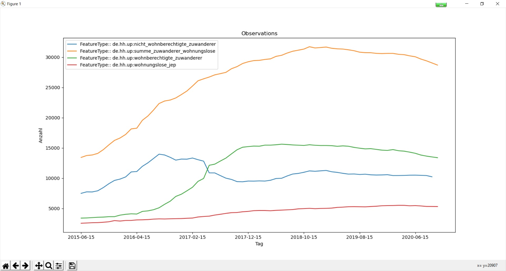

#

Zeitreihen über deegree WFS (GeoJSON)
=====================================

## Inhalt
* [Einleitung](#einleitung)
* [Datenmodell](#datenmodell)
* [Deegree WFS](#deegree-wfs)
* [Testen des WFS](#testen-des-wfs)
* [Summary](#summary)

## Einleitung
Im Rahmen des europäischen Projektes [MICADO](https://www.micadoproject.eu/) (*Migrant Integration Cockpits and Dashboards*) sind diverse Zeitreihen bereitzustellen. Dazu bietet sich die [OGC SensorThings API](https://github.com/enatgvhh/iot-sta) geradezu an. Um schneller ans Ziel zu kommen, wählen wir in diesem Beitrag einen anderen Lösungsweg. Wir werden die Zeitreihen über einen deegree WFS mit dem Output-Format *GeoJSON* bereitstellen.

## Datenmodell
Beim Entwurf orientieren wir uns an der SensorThings API. Das relationale Datenmodell besteht aus den 3 Tabellen *things, datastreams, observations*. Es kann diverse Projekte (*things *) und Parameter (*datastreams *) aufnehmen und speichert alle Beobachtungswerte in einer einzigen Tabelle (*observations *). Für jede Zeitreihe wird hierauf ein View angelegt, der im nächsten Schritt als WFS FeatureType herangezogen wird. Das Datenmodell kann mit dem folgenden [SQL-File](sql/tables.sql) angelegt werden.

Wichtig war mir hierbei, dass in diesem einen Datenspeicher alle Zeitreihen aus verschiedensten Projekte gespeichert werden können. Die dann alle über eine identische Schnittstelle bereitgestellt werden. Genauso wie es bei der SensorThings API der Fall ist.

Über den Zustand der Ausgangsdaten (*formatierte Excel Files*) wollen wir hier besser hinwegsehen. Dazu passt folgendes Zitat vom Autor „*Baut man hier nicht das Dach vor dem Fundament? Schafft den Eindruck, alles wäre super digital verfügbar und tatsächlich führt an der Basis Sachbearbeiter Harald Wundertsich seine Originaldaten noch in einem Excel File? *“ 

## Deegree WFS
Unser [WFS Micado Timeseries](https://geodienste.hamburg.de/HH_WFS_Micado_Timeseries?Service=WFS&Version=2.0.0&Request=GetCapabilities) enthält insgesamt 12 FeatureTypes (*Zeitreihen*). Da der WebService noch im Test-Status ist, kann es sein, dass er außerhalb des Unternehmensnetzes aktuell noch nicht zugänglich ist. Mit dem folgenden [GetFeature-Request](https://geodienste.hamburg.de/HH_WFS_Micado_Timeseries?service=WFS&request=GetFeature&version=2.0.0&typeName=de.hh.up:summe_zuwanderer_wohnungslose&outputformat=application/geo%2Bjson) holen wir uns eine komplette Zeitreihe als GeoJSON (*vgl. Abb. 1*). Dazu muss im Service [config-File](config/wfs_hh_timeseries.xml) das GeoJSON-Format eingetragen sein. Der WFS ist für ein Paging mit einem Count von 1.000 Objekten konfigurieret, d.h. pro Request können maximal 1.000 Objekte angefordert werden. Das spielt gegenwärtig aber noch keine Rolle, da alle Zeitreihen jeweils nur 65 Objekte enthalten.

Abb. 1: GetFeature Response für einen ausgewählten FeatureType (Zeitreihe)

## Testen des WFS
Um sicherzugehen, dass alles passt, programmieren wir mit diesem [Python-Client](src/wfsClient_1_inspect.py) den WFS an und plotten uns die Zeitreihen in einem Chart (*vgl. Abb. 2*).

Abb. 2: Chart mit  4 Zeitreihen

## Summary
In diesem Beitrag haben wir uns mit der Bereitstellung von Zeitreihen über einen deegree WFS im Output-Format GeoJSON befasst. Dabei haben wir Wert auf eine einheitliche Schnittstelle für alle Zeitreihen gelegt. Dies ist der schnellere Weg, der bessere ist nach meiner Meinung die Bereitstellung über die SensorThings API. Natürlich nur dann, wenn man die dahinterstehende IoT-Infrastruktur sowieso schon zur Verfügung stehen hat, die neuen Zeitreihen also nur noch hinzufügen muss.
